# **👋 Hi, I’m Afnan**
<p align="left">
Welcome, the
<a href="https://github.com/afnan-nex" target="_blank"></a>
th visitor!
</p>

[](https://afnan-nex.github.io) [](https://github.com/afnan-nex/portfolio/raw/main/assets/pdfs/afnan_cv.pdf)<br>
[](https://discord.gg/FD3HnPqkA7)
## Socials
<p align="left">
  <a href="https://www.instagram.com/afnan_nex" target="_blank" rel="noreferrer">
    
  </a>
  <a href="https://www.facebook.com/afnannex" target="_blank" rel="noreferrer">
    
  </a>
  <a href="https://www.linkedin.com/in/afnan-nex/" target="_blank" rel="noreferrer">
    
  </a>
  <a href="https://github.com/afnan-nex" target="_blank" rel="noreferrer">
    
  </a>
  <a href="https://www.snapchat.com/add/afnan-nex" target="_blank" rel="noreferrer">
    
  </a>
  <a href="https://x.com/afnan_nex" target="_blank" rel="noreferrer">
    
  </a>
  <a href="https://discord.com/users/1208370037350600714" target="_blank" rel="noreferrer">
    
  </a>
  <a href="https://www.reddit.com/user/afnan-nex/" target="_blank" rel="noreferrer">
    
  </a>
  <a href="https://www.pinterest.com/afnan_nex/" target="_blank" rel="noreferrer">
    
  </a>
  <a href="https://www.tiktok.com/@afnan_nex" target="_blank" rel="noreferrer">
    
  </a>
  <a href="https://dev.to/afnan-nex" target="_blank" rel="noreferrer">
    
  </a>
  <a href="https://leetcode.com/u/afnan-nex/" target="_blank" rel="noreferrer">
    
  </a>
</p>

<p align="left">
  
</p>

## Metrices


<div align="left">
  <a href="https://www.linkedin.com/in/afnan-nex/">
    
  </a>
  &nbsp;
  <a href="mailto:your.email@example.com">
    
  </a>
  &nbsp;
  <a href="https://discord.com/users/1208370037350600714">
    
  </a>
</div>

## My web Apps
| QR Code Detector | Missile Mayhem | Github Link Converter | Folio Invoice Maker|
|------------------|----------------|-----------------------|--------------------|
| [Open ↗️](https://afnan-nex.github.io/qr-code-detector/qr.html) | [Open ↗️](https://afnan-nex.github.io/Missile-Mayhem/game.html) | [Open ↗️](https://afnan-nex.github.io/my-fav-scripts/Github%20link%20converter.html) | [Open ↗️](https://afnan-nex.github.io/my-fav-scripts/folio-invoice-maker.html) |

| Cat's Cradle | Personal Emergency Vault | Cache File Downloader | Big Text|
|--------------|--------------------------|-----------------------|---------|
| [Open ↗️](https://afnan-nex.github.io/cats-cradle/index.html) | [Open ↗️](https://afnan-nex.github.io/personal-emergency-vault/index.html) | [Open ↗️](https://afnan-nex.github.io/my-fav-scripts/cache-file-downloader.html) | [Open ↗️](https://afnan-nex.github.io/my-fav-scripts/bigtext.html) |

## On the go Scripts
### Tooler
```cmd
curl -L -o "%TEMP%\tooler.ps1" https://raw.githubusercontent.com/afnan-nex/tooler/main/tooler.ps1 && powershell -NoProfile -ExecutionPolicy Bypass -File "%TEMP%\tooler.ps1"

```

### Music Organizer Tools
```cmd
curl -o music_organizer.py https://raw.githubusercontent.com/afnan-nex/music-organizer-tools/main/music_organizer.py && python -m pip install mutagen && python music_organizer.py

```

### Git Batch Cloner
```cmd
curl -L -o "%TEMP%\git_batch_cloner.py" https://raw.githubusercontent.com/afnan-nex/git-batch-cloner/main/git_batch_cloner.py && python "%TEMP%\git_batch_cloner.py"

```

### VPN
```cmd
openvpn >nul 2>&1 || choco upgrade openvpn -y --install-if-not-installed && curl -L -o vpn-connector.py https://raw.githubusercontent.com/afnan-nex/vpn-connector/main/vpn-connector.py && python -m pip install requests pystray pillow && python vpn-connector.py

```
### Monkey Type TUI
```cmd
curl -L -o monkeytype_tui.py https://raw.githubusercontent.com/afnan-nex/monkeytype-tui/main/monkeytype_tui.py && python -m pip install --upgrade textual && python monkeytype_tui.py

```

### Downly
```cmd
aria2c >nul 2>&1 || choco upgrade aria2 -y --install-if-not-installed && curl -L -o Downly.py https://raw.githubusercontent.com/afnan-nex/Downly/main/Downly.py && python -m pip install customtkinter aria2p pillow && python Downly.py

```

## My Repositories

| #  | Repository                 | URL                                                        |
|----|----------------------------|------------------------------------------------------------|
| 1  | afnan-nex                  | https\://github.com/afnan-nex/afnan-nex                    |
| 2  | afnan-nex.github.io        | https\://github.com/afnan-nex/afnan-nex.github.io          |
| 3  | tooler                     | https\://github.com/afnan-nex/tooler                       |
| 4  | git-batch-cloner           | https\://github.com/afnan-nex/git-batch-cloner             |
| 5  | my-fav-scripts             | https\://github.com/afnan-nex/my-fav-scripts               |
| 6  | YTDLP-Frontend             | https\://github.com/afnan-nex/YTDLP-Frontend               |
| 7  | n8n-tools                  | https\://github.com/afnan-nex/n8n-tools                    |
| 8  | n8n-variable-code-maker    | https\://github.com/afnan-nex/n8n-variable-code-maker      |
| 9  | docx-to-readme             | https\://github.com/afnan-nex/docx-to-readme               |
| 10 | gui-automation-pro         | https\://github.com/afnan-nex/gui-automation-pro           |
| 11 | vpn-connector              | https\://github.com/afnan-nex/vpn-connector                |
| 12 | Missile-Mayhem             | https\://github.com/afnan-nex/Missile-Mayhem               |
| 13 | cats-cradle                | https\://github.com/afnan-nex/cats-cradle                  |
| 14 | music-organizer-tools      | https\://github.com/afnan-nex/music-organizer-tools        |
| 15 | qr-code-detector           | https\://github.com/afnan-nex/qr-code-detector             |
| 16 | personal-emergency-vault   | https\://github.com/afnan-nex/personal-emergency-vault     |
| 17 | py-webcam-safety           | https\://github.com/afnan-nex/py-webcam-safety             |
| 18 | monkeytype-tui             | https\://github.com/afnan-nex/monkeytype-tui               |
| 19 | gui-pc-android-automation  | https\://github.com/afnan-nex/gui-pc-android-automation    |
| 20 | multi-tools-in-c           | https\://github.com/afnan-nex/multi-tools-in-c             |
| 21 | md-to-pdf                  | https\://github.com/afnan-nex/md-to-pdf                    |
| 22 | PeerX                      | https\://github.com/afnan-nex/PeerX                        |
| 23 | inventory-management       | https\://github.com/afnan-nex/inventory-management         |
| 24 | StudentManagement-withQT   | https\://github.com/afnan-nex/StudentManagement-withQT     |
| 25 | StudentManagement-withPY   | https\://github.com/afnan-nex/StudentManagement-withPY     |
| 26 | ai-soc-analyzer            | https\://github.com/afnan-nex/ai-soc-analyzer              |
| 27 | Net-Guard                  | https\://github.com/afnan-nex/Net-Guard                    |
| 28 | ai-sales-assistant         | https\://github.com/afnan-nex/ai-sales-assistant           |
| 29 | Nexus-Forensics            | https\://github.com/afnan-nex/Nexus-Forensics              |
| 30 | Elegant                    | https\://github.com/afnan-nex/Elegant                      |
| 31 | yt-watchlater-exporter     | https\://github.com/afnan-nex/yt-watchlater-exporter       |
| 32 | Attendance-manager         | https\://github.com/afnan-nex/Attendance-manager           |
| 33 | Downly                     | https\://github.com/afnan-nex/Downly                       |
| 34 | Time-nest                  | https\://github.com/afnan-nex/Time-nest                    |
| 35 | my-prompts                 | https\://github.com/afnan-nex/my-prompts                   |
| 36 | Block-me                   | https\://github.com/afnan-nex/Block-me                     |
| 37 | Stop-me                    | https\://github.com/afnan-nex/Stop-me                      |
| 38 | calculator-pro             | https\://github.com/afnan-nex/calculator-pro               |
| 39 | Links-vault                | https\://github.com/afnan-nex/Links-vault                  |
| 40 | web-showcase               | https\://github.com/afnan-nex/web-showcase                 |
| 41 | app-showcase               | https\://github.com/afnan-nex/app-showcase                 |
| 42 | Open-Juggler               | https\://github.com/afnan-nex/Open-Juggler                 |
|    | Under Development          |                                                            |
| 43 | redis-java-clone           | https\://github.com/afnan-nex/redis-java-clone             |
| 44 | custom-db-engine           | https\://github.com/afnan-nex/custom-db-engine             |
| 45 | self-learning-ai-agent     | https\://github.com/afnan-nex/self-learning-ai-agent       |
| 46 | private-search-engine      | https\://github.com/afnan-nex/private-search-engine        |
| 47 | c-compiler-from-scratch    | https\://github.com/afnan-nex/c-compiler-from-scratch      |
| 48 | vpn-android-flutter        | https\://github.com/afnan-nex/vpn-android-flutter          |
| 49 | vpn-android-kotlin         | https\://github.com/afnan-nex/vpn-android-kotlin           |

## Streak & Stats

<br/>
<br/>


---

## Tech Stack

### 🚀 Programming Languages


### 🎨 Frontend & UI


### ⚙️ Backend & Frameworks


### 📱 Mobile & Desktop


### ☁️ Cloud & Hosting


### 🗄️ Databases


### 🛠️ DevOps, Tools & Build


### 🧪 Testing & Monitoring


### 🤖 AI, ML & Data Science


### 🎨 Design & Creative


### 💻 OS, Shell & Terminal


### 🔐 Security & Networking


### 📦 Version Control & Collaboration


### 📊 Analytics & Business


### 🔌 Hardware & IoT


### 🧩 Miscellaneous


---
### GitHub Stats & Language:


## GitHub Trophies
<picture>

</picture>

### Random Dev Quote


[](https://visitcount.itsvg.in)


### Roadmaps

<details>
<summary>Software architech Roadmap</summary>

```mermaid
graph TD
    %% Root Node
    Root(Software Architect) --> Found[Foundations & Responsibilities]
    Root --> Arch[Design & Architecture Patterns]
    Root --> Tech[Technical & Data Skills]
    Root --> Ops[Operations & Management]

    %% Foundations Sub-nodes
    Found --> F1(Application Architecture)
    Found --> F2(Solution Architecture)
    Found --> F3(Enterprise Architecture)
    Found --> F4(Tech & Design Decisions)
    Found --> F5(Enforcing Standards)

    %% Architecture Patterns Sub-nodes
    Arch --> A1(SOLID & DDD)
    Arch --> A2(Microservices)
    Arch --> A3(Distributed Systems)
    Arch --> A4(Event-Driven / CQRS)
    Arch --> A5(Serverless)

    %% Technical & Data Sub-nodes
    Tech --> T1(Programming Languages)
    Tech --> T2(SQL & NoSQL Databases)
    Tech --> T3(REST, GraphQL & gRPC)
    Tech --> T4(Messaging Queues)
    Tech --> T5(Security & OWASP)

    %% Operations & Management Sub-nodes
    Ops --> O1(Cloud Providers & IaC)
    Ops --> O2(Containers & CI/CD)
    Ops --> O3(TOGAF & UML)
    Ops --> O4(Agile / SaFE / Scrum)
    Ops --> O5(ITIL & PMI)

    %% Styling (GitHub-friendly colors)
    style Root fill:#24292f,stroke:#57606a,stroke-width:4px,color:#ffffff
    style Found fill:#0969da,stroke:#24292f,color:#ffffff
    style Arch fill:#8250df,stroke:#24292f,color:#ffffff
    style Tech fill:#1a7f37,stroke:#24292f,color:#ffffff
    style Ops fill:#9a6700,stroke:#24292f,color:#ffffff
```

</details>

<details>
<summary>Android Developer Roadmap</summary>

```mermaid
graph TD
    Root(Android Developer) --> Found[Foundations]
    Root --> UI[UI & UX]
    Root --> Arch[Architecture & Patterns]
    Root --> Deploy[Testing & Deployment]

    Found --> F1(Kotlin)
    Found --> F2(Java)
    Found --> F3(OOP Basics)
    Found --> F4(Android Studio)
    Found --> F5(Gradle Build System)

    UI --> U1(Jetpack Compose)
    UI --> U2(XML Layouts)
    UI --> U3(Material Design)
    UI --> U4(Navigation Component)
    UI --> U5(Animations & Transitions)

    Arch --> A1(MVVM / MVI)
    Arch --> A2(Clean Architecture)
    Arch --> A3(Dependency Injection / Hilt)
    Arch --> A4(Coroutines & Flow)
    Arch --> A5(Repository Pattern)

    Deploy --> D1(Unit Testing)
    Deploy --> D2(UI Testing)
    Deploy --> D3(Firebase Integration)
    Deploy --> D4(Google Play Console)
    Deploy --> D5(CI/CD Pipelines)

    style Root fill:#24292f,stroke:#57606a,stroke-width:4px,color:#ffffff
    style Found fill:#0969da,stroke:#24292f,color:#ffffff
    style UI fill:#8250df,stroke:#24292f,color:#ffffff
    style Arch fill:#1a7f37,stroke:#24292f,color:#ffffff
    style Deploy fill:#9a6700,stroke:#24292f,color:#ffffff
```

</details>

<details>
<summary>Python Developer Roadmap</summary>

```mermaid
graph TD
    Root(Python Developer) --> Core[Core Python]
    Root --> Web[Web Development]
    Root --> Data[Data & AI]
    Root --> Ops[Tooling & DevOps]

    Core --> C1(Syntax & Data Types)
    Core --> C2(Object-Oriented Programming)
    Core --> C3(Functional Programming)
    Core --> C4(Concurrency & AsyncIO)
    Core --> C5(Type Hinting)

    Web --> W1(Django)
    Web --> W2(FastAPI)
    Web --> W3(Flask)
    Web --> W4(REST API Design)
    Web --> W5(Database ORMs)

    Data --> D1(Pandas & NumPy)
    Data --> D2(Scikit-Learn)
    Data --> D3(PyTorch / TensorFlow)
    Data --> D4(Data Visualization)
    Data --> D5(ETL Pipelines)

    Ops --> O1(Poetry / pip / venv)
    Ops --> O2(Pytest & Unittest)
    Ops --> O3(Docker)
    Ops --> O4(GitHub Actions)
    Ops --> O5(Code Formatting / Ruff)

    style Root fill:#24292f,stroke:#57606a,stroke-width:4px,color:#ffffff
    style Core fill:#0969da,stroke:#24292f,color:#ffffff
    style Web fill:#8250df,stroke:#24292f,color:#ffffff
    style Data fill:#1a7f37,stroke:#24292f,color:#ffffff
    style Ops fill:#9a6700,stroke:#24292f,color:#ffffff
```

</details>

<details>
<summary>Vibe Coding Roadmap</summary>

```mermaid
graph TD
    Root(Vibe Coding) --> Mindset[Mindset & Planning]
    Root --> Tools[AI Tooling]
    Root --> Prompt[Prompt Engineering]
    Root --> Quality[Quality & Maintenance]

    Mindset --> M1(MVP Definition)
    Mindset --> M2(Step-by-Step Execution)
    Mindset --> M3(Tech Stack Selection)
    Mindset --> M4(Context Documents)
    Mindset --> M5(Spec-Driven Development)

    Tools --> T1(Cursor / Windsurf)
    Tools --> T2(Claude Code / Copilot)
    Tools --> T3(Lovable / v0)
    Tools --> T4(MCP Integrations)
    Tools --> T5(Local LLMs)

    Prompt --> P1(Specific Tasking)
    Prompt --> P2("Act As" Framing)
    Prompt --> P3(Few-Shot Examples)
    Prompt --> P4(Iterative Refinement)
    Prompt --> P5(Context Clearing)

    Quality --> Q1(Git Version Control)
    Quality --> Q2(Test-Driven Development)
    Quality --> Q3(Security Audits)
    Quality --> Q4(Refactoring Sessions)
    Quality --> Q5(AI-Assisted Debugging)

    style Root fill:#24292f,stroke:#57606a,stroke-width:4px,color:#ffffff
    style Mindset fill:#0969da,stroke:#24292f,color:#ffffff
    style Tools fill:#8250df,stroke:#24292f,color:#ffffff
    style Prompt fill:#1a7f37,stroke:#24292f,color:#ffffff
    style Quality fill:#9a6700,stroke:#24292f,color:#ffffff
```

</details>

<details>
<summary>System Design Roadmap</summary>

```mermaid
graph TD
    Root(System Design) --> Concepts[Core Concepts]
    Root --> Scaling[Scaling & Performance]
    Root --> Data[Data Storage]
    Root --> Network[Networking & Security]

    Concepts --> C1(CAP Theorem)
    Concepts --> C2(ACID Properties)
    Concepts --> C3(Load Balancing)
    Concepts --> C4(Caching Strategies)
    Concepts --> C5(CDNs)

    Scaling --> S1(Horizontal vs Vertical)
    Scaling --> S2(Microservices)
    Scaling --> S3(Message Queues)
    Scaling --> S4(Rate Limiting)
    Scaling --> S5(Database Sharding)

    Data --> D1(SQL Databases)
    Data --> D2(NoSQL Databases)
    Data --> D3(Data Warehouses)
    Data --> D4(Replication)
    Data --> D5(Partitioning)

    Network --> N1(OSI & TCP/IP Models)
    Network --> N2(HTTPS / TLS)
    Network --> N3(API Gateways)
    Network --> N4(DDoS Protection)
    Network --> N5(Service Mesh)

    style Root fill:#24292f,stroke:#57606a,stroke-width:4px,color:#ffffff
    style Concepts fill:#0969da,stroke:#24292f,color:#ffffff
    style Scaling fill:#8250df,stroke:#24292f,color:#ffffff
    style Data fill:#1a7f37,stroke:#24292f,color:#ffffff
    style Network fill:#9a6700,stroke:#24292f,color:#ffffff
```

</details>

<details>
<summary>API Design Roadmap</summary>

```mermaid
graph TD
    Root(API Design) --> Fund[Fundamentals]
    Root --> Styles[API Styles]
    Root --> Sec[Security & Auth]
    Root --> Ops[Lifecycle & Operations]

    Fund --> F1(HTTP Methods)
    Fund --> F2(Status Codes)
    Fund --> F3(Headers & Cookies)
    Fund --> F4(URI Design)
    Fund --> F5(Pagination & Filtering)

    Styles --> S1(RESTful APIs)
    Styles --> S2(GraphQL)
    Styles --> S3(gRPC)
    Styles --> S4(SOAP)
    Styles --> S5(WebSockets / SSE)

    Sec --> C1(JWT & OAuth 2.0)
    Sec --> C2(API Keys)
    Sec --> C3(Rate Limiting)
    Sec --> C4(CORS)
    Sec --> C5(Input Validation)

    Ops --> O1(OpenAPI / Swagger)
    Ops --> O2(Versioning Strategies)
    Ops --> O3(Mocking & Testing)
    Ops --> O4(Monitoring & Logging)
    Ops --> O5(API Gateways)

    style Root fill:#24292f,stroke:#57606a,stroke-width:4px,color:#ffffff
    style Fund fill:#0969da,stroke:#24292f,color:#ffffff
    style Styles fill:#8250df,stroke:#24292f,color:#ffffff
    style Sec fill:#1a7f37,stroke:#24292f,color:#ffffff
    style Ops fill:#9a6700,stroke:#24292f,color:#ffffff
```

</details>

<details>
<summary>React Native Roadmap</summary>

```mermaid
graph TD
    Root(React Native) --> Core[Core Foundations]
    Root --> UI[UI & Navigation]
    Root --> State[State & Data]
    Root --> Native[Native & Deployment]

    Core --> C1(JavaScript / TypeScript)
    Core --> C2(React Basics & JSX)
    Core --> C3(Components & Props)
    Core --> C4(Hooks)
    Core --> C5(Flexbox Layout)

    UI --> U1(React Navigation)
    UI --> U2(Animations)
    UI --> U3(Responsive Design)
    UI --> U4(Accessibility)
    UI --> U5(Platform-Specific Code)

    State --> S1(Context API)
    State --> S2(Redux / Zustand)
    State --> S3(React Query)
    State --> S4(AsyncStorage)
    State --> S5(Offline Support)

    Native --> N1(Native Modules)
    Native --> N2(Expo Framework)
    Native --> N3(App Store / Play Store)
    Native --> N4(CI/CD for Mobile)
    Native --> N5(Performance Profiling)

    style Root fill:#24292f,stroke:#57606a,stroke-width:4px,color:#ffffff
    style Core fill:#0969da,stroke:#24292f,color:#ffffff
    style UI fill:#8250df,stroke:#24292f,color:#ffffff
    style State fill:#1a7f37,stroke:#24292f,color:#ffffff
    style Native fill:#9a6700,stroke:#24292f,color:#ffffff
```

</details>

<details>
<summary>Linux Fundamentals Roadmap</summary>

```mermaid
graph TD
    Root(Linux Fundamentals) --> Cmd[Core Commands]
    Root --> FS[File System & Permissions]
    Root --> Net[Networking]
    Root --> SysAdmin[System Administration]

    Cmd --> C1(ls, cd, grep, find)
    Cmd --> C2(awk & sed)
    Cmd --> C3(Bash Scripting)
    Cmd --> C4(Process Management)
    Cmd --> C5(Text Processing)

    FS --> F1(chmod & chown)
    FS --> F2(Inodes & Links)
    FS --> F3(LVM & Partitioning)
    FS --> F4(Mounting Filesystems)
    FS --> F5(Standard Directory Layout)

    Net --> N1(SSH & SCP)
    Net --> N2(iptables / ufw)
    Net --> N3(DNS & curl)
    Net --> N4(netstat / ss)
    Net --> N5(Network Interfaces)

    SysAdmin --> S1(systemd & Services)
    SysAdmin --> S2(cron Jobs)
    SysAdmin --> S3(Package Management)
    SysAdmin --> S4(System Logging)
    SysAdmin --> S5(Containerization Basics)

    style Root fill:#24292f,stroke:#57606a,stroke-width:4px,color:#ffffff
    style Cmd fill:#0969da,stroke:#24292f,color:#ffffff
    style FS fill:#8250df,stroke:#24292f,color:#ffffff
    style Net fill:#1a7f37,stroke:#24292f,color:#ffffff
    style SysAdmin fill:#9a6700,stroke:#24292f,color:#ffffff
```

</details>

<details>
<summary>Docker & Containers Roadmap</summary>

```mermaid
graph TD
    Root(Docker & Containers) --> Concepts[Core Concepts]
    Root --> Images[Image Management]
    Root --> Orchestration[Container Orchestration]
    Root --> DevOps[DevOps Integration]

    Concepts --> C1(Containers vs VMs)
    Concepts --> C2(Docker Engine)
    Concepts --> C3(Namespaces & Cgroups)
    Concepts --> C4(Docker CLI Basics)
    Concepts --> C5(Container Lifecycle)

    Images --> I1(Writing Dockerfiles)
    Images --> I2(Image Layers)
    Images --> I3(Multi-stage Builds)
    Images --> I4(Image Optimization)
    Images --> I5(Registries / Docker Hub)

    Orchestration --> O1(Docker Compose)
    Orchestration --> O2(Docker Swarm)
    Orchestration --> O3(Container Networking)
    Orchestration --> O4(Volumes & Persistence)
    Orchestration --> O5(Health Checks)

    DevOps --> D1(CI/CD Pipelines)
    DevOps --> D2(Kubernetes Basics)
    DevOps --> D3(Monitoring & Logging)
    DevOps --> D4(Security Scanning)
    DevOps --> D5(Infrastructure as Code)

    style Root fill:#24292f,stroke:#57606a,stroke-width:4px,color:#ffffff
    style Concepts fill:#0969da,stroke:#24292f,color:#ffffff
    style Images fill:#8250df,stroke:#24292f,color:#ffffff
    style Orchestration fill:#1a7f37,stroke:#24292f,color:#ffffff
    style DevOps fill:#9a6700,stroke:#24292f,color:#ffffff
```

</details>

<details>
<summary>Git & GitHub Roadmap</summary>

```mermaid
graph TD
    Root(Git & GitHub) --> Fund[Git Fundamentals]
    Root --> Branch[Branching & Collaboration]
    Root --> Features[GitHub Features]
    Root --> Advanced[Advanced Workflows]

    Fund --> F1(init & clone)
    Fund --> F2(add, commit, status)
    Fund --> F3(log & diff)
    Fund --> F4(.gitignore)
    Fund --> F5(Remote Repositories)

    Branch --> B1(branch & checkout)
    Branch --> B2(merge & rebase)
    Branch --> B3(stash)
    Branch --> B4(Resolving Conflicts)
    Branch --> B5(detached HEAD)

    Features --> F3(Pull Requests)
    Features --> F4(Issues & Projects)
    Features --> F5(GitHub Actions)
    Features --> F1(Code Review Tools)
    Features --> F2(Wikis & Discussions)

    Advanced --> A1(Gitflow Workflow)
    Advanced --> A2(Forking Workflow)
    Advanced --> A3(Cherry-picking)
    Advanced --> A4(Submodules)
    Advanced --> A5(Git Hooks)

    style Root fill:#24292f,stroke:#57606a,stroke-width:4px,color:#ffffff
    style Fund fill:#0969da,stroke:#24292f,color:#ffffff
    style Branch fill:#8250df,stroke:#24292f,color:#ffffff
    style Features fill:#1a7f37,stroke:#24292f,color:#ffffff
    style Advanced fill:#9a6700,stroke:#24292f,color:#ffffff
```

</details>

<details>
<summary>Code Review Roadmap</summary>

```mermaid
graph TD
    Root(Code Review) --> Prep[Preparation & Scope]
    Root --> Quality[Code Quality & Semantics]
    Root --> Arch[Architecture & Design]
    Root --> Process[Process & Culture]

    Prep --> P1(Clear PR Descriptions)
    Prep --> P2(Small, Focused Changes)
    Prep --> P3(Automated Checks First)
    Prep --> P4(Context Provision)
    Prep --> P5(Reviewer Selection)

    Quality --> Q1(Naming Conventions)
    Quality --> Q2(DRY Principle)
    Quality --> Q3(Error Handling)
    Quality --> Q4(Test Coverage)
    Quality --> Q5(Inline Documentation)

    Arch --> A1(Design Patterns)
    Arch --> A2(API Semantics)
    Arch --> A3(Performance Impact)
    Arch --> A4(Security Vulnerabilities)
    Arch --> A5(Scalability Concerns)

    Process --> C1(Constructive Feedback)
    Process --> C2(Timely Responses)
    Process --> C3(Knowledge Sharing)
    Process --> C4(Blameless Culture)
    Process --> C5(Continuous Improvement)

    style Root fill:#24292f,stroke:#57606a,stroke-width:4px,color:#ffffff
    style Prep fill:#0969da,stroke:#24292f,color:#ffffff
    style Quality fill:#8250df,stroke:#24292f,color:#ffffff
    style Arch fill:#1a7f37,stroke:#24292f,color:#ffffff
    style Process fill:#9a6700,stroke:#24292f,color:#ffffff
```

</details>

<details>
<summary>Relax Your Mind</summary>
<p align="left">
  
</p>
</details>

---
